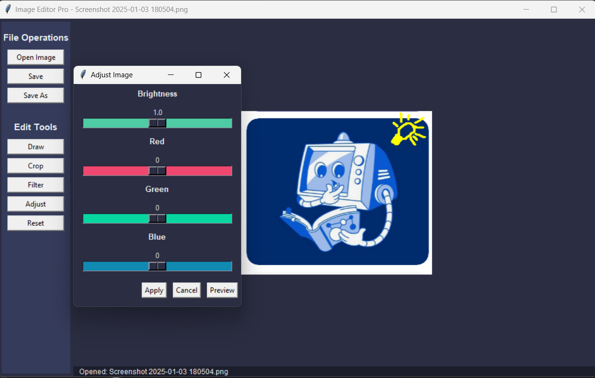

# Image Editor Pro



## Overview
Image Editor Pro is a simple image editing application built using Python and Tkinter. It allows users to perform basic image manipulations such as adjusting brightness, applying filters, cropping, and drawing.

## Features
- Open and save images in multiple formats
- Adjust brightness and color levels
- Apply filters like black & white, sepia, emboss, and blur
- Crop and resize images
- Freehand drawing with color selection

## Installation & Setup
### Prerequisites
- Python 3.x
- OpenCV (`cv2`)
- Tkinter (built into Python)
- PIL (Pillow)

### Steps
1. Clone the repository:
   ```bash
   git clone https://github.com/isha1221/py-image-editor.git
   cd image-editor
   ```
2. Install dependencies:
   ```bash
   pip install opencv-python pillow
   ```
3. Run the application:
   ```bash
   python main.py
   ```

## Usage
- Click **Open Image** to load an image.
- Use **Adjust** to modify brightness and color levels.
- Apply filters from the **Filter** menu.
- Use **Crop** to select and crop a portion of the image.
- Select **Draw** to freehand draw on the image.
- Click **Save** or **Save As** to store your edited image.


## Contributing
Feel free to fork this repository and submit pull requests for improvements!


